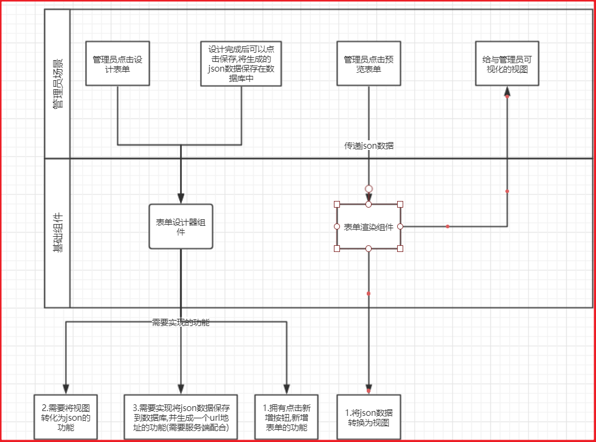

# flow-form-design
> 用于设计流程引擎的外置表单设计器,基于vue实现
>
> 目录结构为
>
> front---前端项目(基于vue构建表单设计器,前端项目通过vue官方脚手架直接构建)
>
> backend---后端项目(基于springboot构建)

# 需要实现的功能,以及设计大纲

# 如何推进流程?

主要是通过前端提前定义好通用的rest接口调用。

后端定义好通用的controller接口,使用Map<String,String>来接收数据,启动或提交表单。

# 前端主要工作任务

在我看来流程设计组件与表单渲染组件应该是包含关系,流程设计组件中需要有表单渲染组件,这样才能第一时间,将用户设计的表单呈现出来。

所以在编写代码的时候,一定要将表单设计组件与表单渲染组件分离,再进行调用,降低耦合,为后面在给客户呈现时,保证表单渲染组件的复用性。